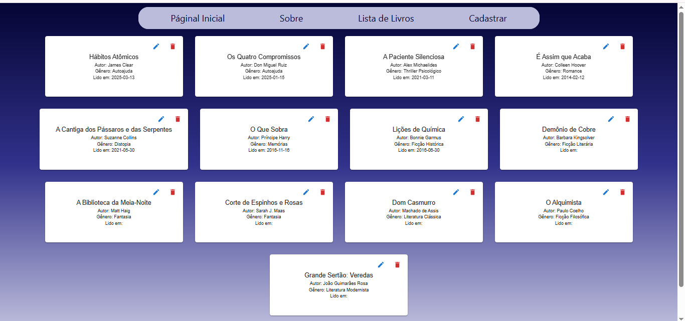
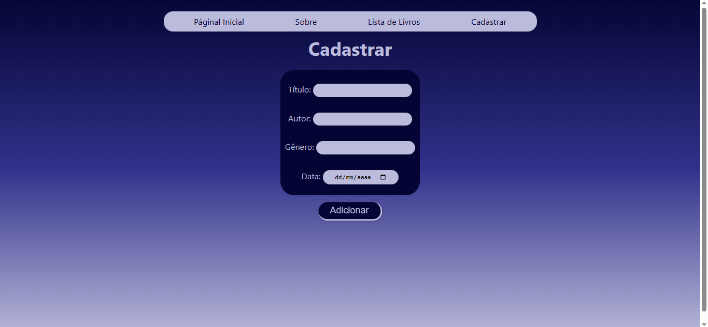

# 📚 Gerenciador de Livros

Este projeto é uma aplicação React que se integra a uma API REST para o gerenciamento de livros. Ele permite adicionar, editar, listar e remover livros, utilizando uma API baseada em um arquivo JSON para persistência dos dados.

## 🛠 Tecnologias Utilizadas

Frontend:

- React.js
- React Router
- Context API
- LocalStorage
- CSS
- Vite
- Axios
- Material-UI (MUI)
- Vitest (testes)
- Testing Library (renderização e interação nos testes)

Backend:

- Node.js
- Express
- JSON como banco de dados

## ⚙️ Funcionalidades

- Listagem de livros
- Adição de novos livros
- Edição de livros existentes
- Exclusão de livros
- Persistência dos dados via API

## 📷 Capturas de Tela





## 🎥 Demonstração em Vídeo

[🎬 Ver vídeo demonstração](https://www.loom.com/share/0b36938dfdf34ddd90e55a1e6e0cc692?sid=87aaebb8-983e-4607-9c19-4d803870a876)

## 🚀 Como Executar o Projeto

### 💻 1. Configurar e Iniciar o Backend

1. Clone o repositório da API:

```sh
  git clone https://github.com/adsPucrsOnline/DesenvolvimentoFrontend/
```

2. Entre na pasta da API:
   ```sh
   Utilizando o mesmo terminal, entre na pasta da API: cd ./DesenvolvimentoFrontend/readingJournal-api/
   ```
3. Inicie o servidor:
   ```sh
   npm install e em seguida npm start
   ```
4. A API estará rodando em `http://localhost:5000`.

### 🌐 2. Configurar e Iniciar o Frontend

1.  Clone o repositório

```sh
 git clone https://github.com/vitoriadalri/crud-livros.git
 cd crud-livros
```

2. Instale as dependências

```sh
 npm install
```

3. Inicie o servidor de desenvolvimento

```sh
 npm run dev
```

A aplicação estará disponível em `http://localhost:5173/`.

## 🧪 Testes

### 🌐 3. Configurar e Iniciar os Testes

1. Certifique-se de que todas as dependências estão instaladas:

```sh
 npm install
```

2. Mude para a pasta 'src':

```sh
 cd src
```

3. Execute os testes com o comando:

```sh
 npx vitest
```

### 🔍 O que está sendo testado?

- **BookContext** – Adição e remoção de livros, integração com o `localStorage`.
- **BookForm** – Renderização do formulário e manipulação de entrada de dados.
- **EditBook** – Edição de livros com envio de dados atualizados.
- **BookList** – Renderização da lista de livros.
- **Rotas** – Validação das rotas principais com renderização correta das páginas.
- **NavBar, Home, Sobre, Cadastro, EditarLivro** – Testes básicos de renderização.

## 🔧 Funcionalidades

✅ Adicionar livros com título, autor, gênero e data de publicação.
✅ Editar detalhes de um livro já cadastrado.
✅ Excluir livros da lista.
✅ Armazenamento persistente utilizando `localStorage`.

## 🔄 Integração com a API

O frontend consome a API via **Axios**. As principais requisições feitas são:

- **Listar livros:** `GET http://localhost:5000/books`
- **Buscar livro por ID:** `GET http://localhost:5000/books/:id`
- **Criar livro:** `POST http://localhost:5000/books`
- **Atualizar dados de um livro:** `PUT http://localhost:5000/books/:id`
- **Remover livro:** `DELETE http://localhost:5000/books/:id`

## 📂 Estrutura do Projeto

```
/src
  ├── components
  │   ├── BookList.jsx
  │   ├── BookForm.jsx
  │   ├── EditBook.jsx
  │
  ├── contexts
  │   ├── BookContext.jsx
  ├
  ├── pages
  │   ├── Home.jsx
  │   ├── Cadastro.jsx
  │   ├── EditarLivro.jsx
  │
  ├── routes
  │   ├── Routes.jsx
  ├
  ├── screenshots
  │   ├── cadastro.png
  │   ├── home.png
  │   ├── listaDeLivros.png
  │   ├── sobre.png
  |
  ├── services
  │   ├── api.js
  |
  ├── tests
  │   ├── BookContext.test.jsx
  │   ├── BookForm.test.jsx
  │   ├── BookList.test.jsx
  │   ├── Cadastro.test.jsx
  │   ├── Editar.test.jsx
  │   ├── EditBook.test.jsx
  │   ├── Home.test.jsx
  │   ├── ListaDeLivros.test.jsx
  │   ├── NavBar.test.jsx
  │   ├── Routes.test.jsx
  │   ├── Sobre.test.jsx
  │   ├── setupTests.js
  │
  │
  ├── App.jsx
  ├── main.jsx
  ├── index.css
```

### Conclusão

Este projeto é uma aplicação que utiliza tecnologias HTML, CSS, JavaScript, Vite, React, para gerenciar um catálogo de livros. Ele permite que os usuários cadastrem novos livros, visualizem a lista de livros cadastrados e naveguem entre as páginas da aplicação.
